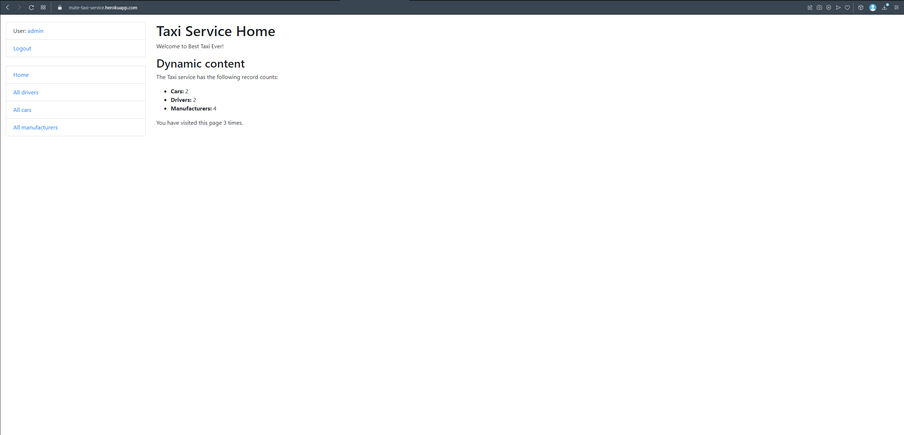
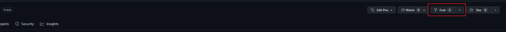
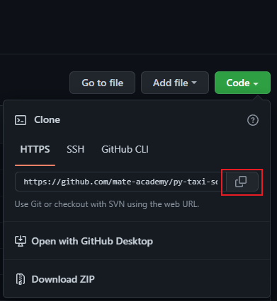

# Hi, that's my first Django project

#### This project is a basic present of taxi service, in this release you can only create, delete, update, read

#### cars, drivers, and manufacturers for cars.

Everybody can take this project and modified for himself, that's can help you with study :)

### You can check out what the project looks like [here](http://mate-taxi-service.herokuapp.com/)

If you want to log in:

```
Username: user
Password: user12345
```



#### For install this project you must fork this repo and clone for your local repositories.





In your terminal write:

```
git clone <link>
```

Then open project in your IDE and install all requirements.

### If you work in Pycharm:

You must just press ok in window with requirements

### In another IDE:

```
python -m venv venv
venv/Scripts/activate (on Windows)
pip install -r requirements.txt
```

After that, project ready to work!
<br>
Just run server:

```
python manage.py runserver
```

By default, server will run in `127.0.0.1:8000`
If you want to communicate with site, you can create admin account

```
python manage.py createsuperuser
```

### Good luck!